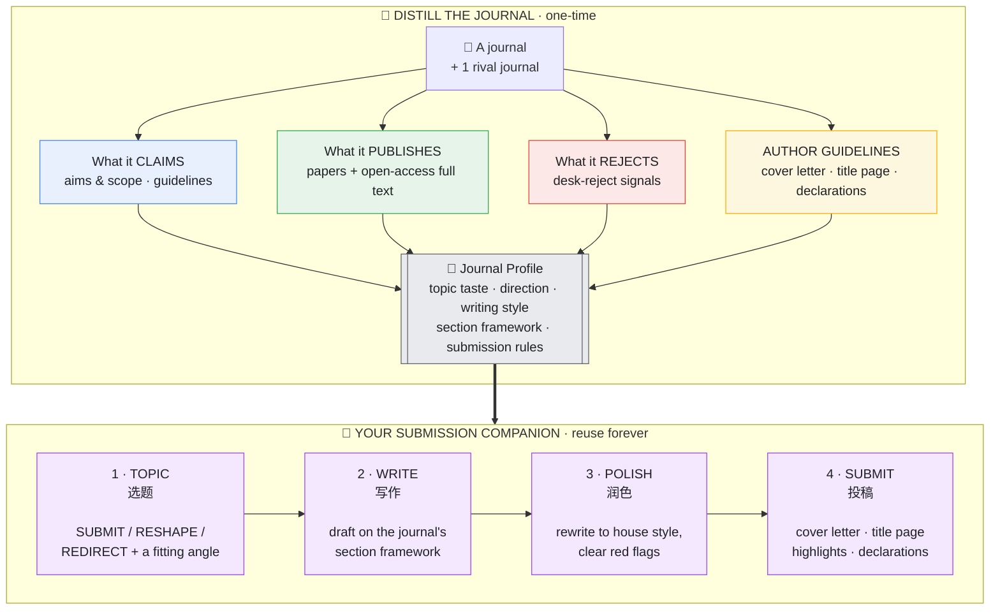

<div align="center">

# 📕 Journal Decoder · 期刊解码器

**Distill any academic journal into a reusable Claude skill — then let it guide you from topic to submission.**

[English](README.md) · [中文](README_zh.md)

</div>

> Point Journal Decoder at a journal. It studies that journal's published papers, its author guidelines, its aims & scope — reading open-access full texts when it can — and packages everything into a standalone skill, `<journal>-fit`, that becomes your **submission companion**: it tells you whether your idea fits, drafts your paper on that journal's framework, polishes it into the house style, and writes your **cover letter** and **title page**.
>
> 把它对准一本期刊，它会研究这本刊发表的论文、作者指南、aims & scope（能找到开放获取全文就连全文一起读），打包成一个独立技能 `<journal>-fit`，成为你的**投稿伴侣**：判断选题适配、按该刊框架起草论文、润色成该刊风格、并写好你的 **cover letter** 和 **title page**。

A skill for [Claude Code](https://docs.anthropic.com/en/docs/claude-code) and the Claude Agent SDK. **Tool-agnostic** — runs on plain web access + PDF reading, no paid APIs required.

---

## How it works · the big picture



**Distill once, reuse forever.** Distilling a journal takes one research pass; the resulting `<journal>-fit` skill then helps with every paper you send there.

---

## What it learns about a journal · the Journal Profile

| # | Part | What it captures |
|---|------|------------------|
| 1 | **Aims & scope** | the official positioning — and what it really means in practice |
| 2 | **Topic taste & direction** | what it publishes, what's surging, what's saturated, which gaps it wants filled |
| 3 | **Author guidelines → submission kit** | word/abstract limits, highlights, **cover-letter** expectations, **title-page** elements, mandatory declarations (competing interest, CRediT, data, ethics, AI-use), reference style |
| 4 | **Writing style & framework** | from published papers *and open-access full texts*: the section-by-section move structure, abstract recipe, title patterns, voice |
| 5 | **Editorial decision model** | the three stages a paper clears (editor screen → peer review → acceptance shape) and the desk-reject red flags |

---

## The four-step companion · what you actually do with it

### 1 · TOPIC — *"Should I send this here?"*
Give it an idea or abstract. It runs your work through the journal's gauntlet and returns a verdict — **SUBMIT**, **RESHAPE** (right journal, wrong framing), or **REDIRECT** (send it elsewhere, and here's where) — then proposes 2–3 angles that match what the journal actually wants.

### 2 · WRITE — *"Draft it the way this journal writes."*
It hands you the journal's own section-by-section skeleton: how the introduction funnels to the gap, where the research questions land, how Methods is subdivided, how Results are reported, the six moves of a Discussion — plus the abstract recipe and title patterns, each anchored to a real published example.

### 3 · POLISH — *"Make my draft read like it belongs here."*
Paste a paragraph or a full draft. It does a **before → after** on your own text, flags every sentence that doesn't match the house style, enforces the word/abstract limits, and clears each desk-reject red flag.

### 4 · SUBMIT — *"Get me submission-ready."*
It generates your **cover letter** (to the journal's expected beats), your **title page** (exactly the required elements, respecting anonymized-review rules), your highlights/structured abstract, and a **declarations checklist** so nothing trips a desk reject.

---

## A worked example (Computers & Education)

The repo ships a real distillation: [`examples/computers-education-fit/`](examples/computers-education-fit/). Here's the kind of interaction it powers.

**① TOPIC**
> **You:** Is this a fit for C&E? *"We built a ChatGPT plugin and surveyed 40 students in my class; 85% said it was helpful and easy to use."*
>
> **Companion:** **REDIRECT / borderline RESHAPE.** Two Stage-1 red flags fire: it's a **single-class satisfaction/acceptance study** (TAM-style "helpful & easy"), with **no measured learning outcome** and no relevance beyond one classroom. To RESHAPE for C&E: replace the satisfaction survey with a design that measures a learning construct (e.g. self-regulated-learning gains vs a control), and argue why it generalizes. As-is, it fits a technology-acceptance or practitioner venue better than C&E.

**② WRITE** — *"Give me a C&E-style title and abstract skeleton."*
> **Title pattern:** *name the construct + signal the design* → e.g. "The effect of GPT-based scaffolding on self-regulated learning: A quasi-experimental study."
> **Abstract (≤250 words, 6 moves):** ① why SRL matters in online learning → ② the gap → ③ what you did (design + N) → ④ method in one line → ⑤ key result with effect size → ⑥ implications for teaching.

**③ POLISH** — before → after on one sentence:
> **Before:** "Students really liked the tool and found it easy to use."
> **After:** "Students using the GPT scaffold showed higher self-regulated-learning scores than the control group (d = 0.42), suggesting the scaffold supports metacognitive monitoring." *(C&E rewards a measured learning effect, not satisfaction.)*

**④ SUBMIT** — a cover-letter opener it drafts for you:
> "Dear Editor, we submit *'The effect of GPT-based scaffolding on self-regulated learning'* for consideration in *Computers & Education*. Across a 12-week quasi-experiment (N = 210), the scaffold improved self-regulated-learning outcomes relative to a matched control — evidence that speaks to the wider education community's question of how generative AI can support, rather than replace, student regulation…"
> …plus a **title-page checklist** (C&E is double-anonymized → identity on a separate page) and a **declarations checklist** (competing interest, CRediT, data availability, AI-use).

Open [`examples/computers-education-fit/references/evidence/`](examples/computers-education-fit/references/evidence/) to see the sourced research behind every claim above — what C&E *says*, *publishes*, *rejects*, its *guidelines*, its *writing framework* (from 3 open-access full texts), and how it differs from BJET.

---

## The one rule that keeps it sharp · the rival-journal test

Most "journal writing tips" are true of the whole field (use IMRaD, state limitations) — useless as guidance. Journal Decoder keeps a finding **only if it would change which of two similar journals you'd submit to.** That's why you give it **one rival journal** to compare against — it's how the skill separates *this journal's* house style from the whole field's norms. Without a rival, the result degrades into generic advice.

It's also built to be **honest**: it never fabricates acceptance rates or guideline details, never dresses up field-wide norms as special taste, always surfaces the gap between what a journal *claims* and what it *publishes*, and reminds you that fit raises the odds but never guarantees acceptance.

---

## Install

```bash
git clone https://github.com/Youn-17/journal-decoder.git

# user-level (every project) / 用户级
cp -R journal-decoder ~/.claude/skills/journal-decoder

# or project-level / 或项目级
mkdir -p .claude/skills && cp -R journal-decoder .claude/skills/journal-decoder
```
Restart Claude Code. The only required files are `SKILL.md` + `references/`. To use a pre-distilled journal, also copy `examples/computers-education-fit` into your skills folder.

## Usage

```
Distill the journal Computers & Education      # build the companion
蒸馏 Journal of the Learning Sciences           # rival journal optional
Where should I submit a study on GenAI + learning analytics?   # vague need → it recommends candidates

# once distilled:
Is this abstract a fit for Computers & Education?  [paste]
Draft a C&E-style introduction for this study
Write my cover letter and title page for C&E
```

---

## Repo layout

```
journal-decoder/
├── SKILL.md                       # the decoder (5-part distillation + 4-step build)
├── references/
│   ├── signal-mining.md           # keep real findings, drop noise; full-text → framework; guidelines → kit
│   └── fit-skill-template.md      # skeleton for each <journal>-fit companion
└── examples/
    └── computers-education-fit/   # a real, fully-distilled journal
        ├── SKILL.md
        └── references/evidence/   # claims · published · rejected · guidelines · writing-framework · rival-bjet
```

## Contributing

PRs welcome — especially new distilled journals under `examples/`, and improvements to the methodology. Please keep every distillation grounded in real, sourced evidence (each claim with a URL + confidence tag).

## Author & License

Created by **Adrian** ([@Youn-17](https://github.com/Youn-17)). Licensed under [MIT](LICENSE) © 2026 Adrian.

> Made with [Claude Code](https://claude.com/claude-code).
