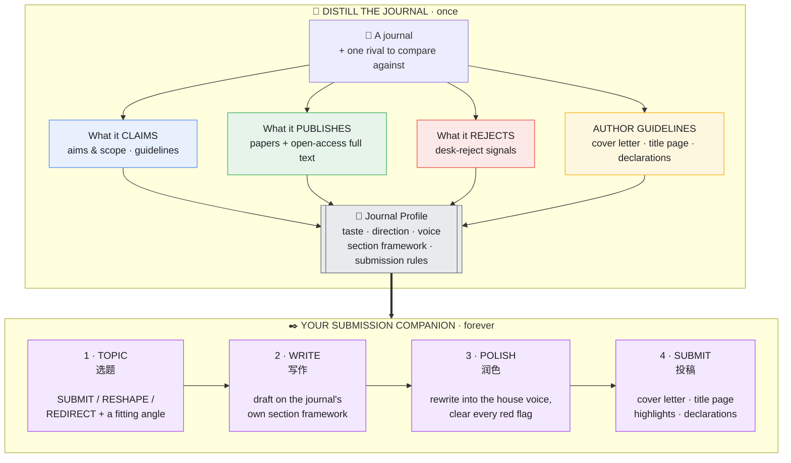

<div align="center">

# Imprimatur · 付梓

### Learn a journal by heart. Earn its imprimatur.

**Distill any academic journal into a reusable Claude skill — one that knows its taste, writes in its voice, and walks your manuscript from first idea to final submission.**

[English](README.md) · [中文](README_zh.md)

<sub>*imprimatur* — Latin, "let it be printed": the seal that a work is fit to publish.</sub>

</div>

---

Every journal has a temperament. It favours certain questions and quietly turns others away; it rewards one way of framing a contribution and desk-rejects another; its accepted papers share a cadence you can feel but rarely name. Authors spend years absorbing this by osmosis — a rejection at a time.

**Imprimatur compresses that apprenticeship into one research pass.** Point it at a journal. It reads what the journal *says* it wants, what it *actually* publishes, what it quietly *rejects*, and its full author guidelines — going into open-access full texts when it can — then packages everything into a standalone skill, `<journal>-fit`, that becomes your companion for that venue: it judges whether your idea belongs, drafts your paper in the journal's own architecture, polishes it into the house voice, and hands you the cover letter and title page to send.

Built for [Claude Code](https://docs.anthropic.com/en/docs/claude-code) and the Claude Agent SDK. **No paid APIs, no lock-in** — it runs on ordinary web access and PDF reading, so it works for anyone.

---

## The idea in one picture



**Distil once, reuse forever.** One research pass builds the profile; the `<journal>-fit` skill it leaves behind helps with every paper you ever send there.

---

## What it learns about a journal

| | Dimension | What it captures |
|---|---|---|
| 1 | **Aims & scope** | the official positioning — and what it really means in practice |
| 2 | **Topic taste & direction** | what gets published, what's surging, what's saturated, which gaps the editors quietly want filled |
| 3 | **Author guidelines → submission kit** | word and abstract limits, highlights, the **cover-letter** beats it expects, the exact **title-page** elements, every mandatory declaration (competing interest, CRediT, data, ethics, AI-use), reference style |
| 4 | **Writing voice & framework** | from published papers *and open-access full texts*: the section-by-section move structure, the abstract recipe, the title patterns, the cadence |
| 5 | **Editorial decision model** | the three gates a paper clears — editor's desk → peer review → the shape of accepted work — and the red flags that end a submission early |

---

## What you do with it — four steps

> **1 · TOPIC — *should this go here?***
> Hand it an idea or an abstract. It runs your work past the journal's gatekeepers and returns a verdict — **SUBMIT**, **RESHAPE** (right journal, wrong framing), or **REDIRECT** (try elsewhere — and here's where) — then offers two or three angles that match what the journal actually wants.

> **2 · WRITE — *draft it the way this journal writes.***
> It gives you the journal's own scaffolding: how the introduction funnels to the gap, where the research questions land, how the methods are sectioned, how results are reported, the fixed moves of a discussion — plus the abstract recipe and title patterns, each anchored to a real published paper.

> **3 · POLISH — *make my draft sound like it belongs.***
> Paste a paragraph or a whole draft. It works on *your* sentences — a clean before → after — flags whatever breaks the house voice, holds you to the word and abstract limits, and clears every desk-reject trap.

> **4 · SUBMIT — *get me submission-ready.***
> It drafts your **cover letter** in the beats this journal expects, lays out your **title page** with exactly the required elements (respecting anonymized-review rules), assembles your highlights and structured abstract, and runs a **declarations checklist** so nothing trivial sinks you at the desk.

---

## See it work — *Computers & Education*

The repo ships a complete, fully-sourced distillation: [`examples/computers-education-fit/`](examples/computers-education-fit/). A taste of what it powers:

**TOPIC** — *"Is this a fit? We built a ChatGPT plugin and surveyed 40 students in my class; 85% said it was helpful and easy to use."*
> **REDIRECT — borderline RESHAPE.** Two desk-reject flags fire: it's a single-class **satisfaction/acceptance** study with **no measured learning outcome** and no reach beyond one classroom. To make it C&E-worthy, swap the satisfaction survey for a design that measures a learning construct (e.g. self-regulation gains against a control) and argue why it generalises. As written, a technology-acceptance venue suits it better.

**WRITE** — a C&E-shaped title and abstract spine:
> *Title* (name the construct + signal the design): "The effect of GPT-based scaffolding on self-regulated learning: A quasi-experimental study."
> *Abstract* (≤250 words, six moves): why self-regulation matters online → the gap → what you did (design + N) → method in a line → the key effect with its size → what it means for teaching.

**POLISH** — one sentence, before → after:
> ~~"Students really liked the tool and found it easy to use."~~ → "Students using the GPT scaffold scored higher on self-regulated learning than the control group (*d* = 0.42), suggesting the scaffold supports metacognitive monitoring." *(C&E rewards a measured learning effect, not satisfaction.)*

**SUBMIT** — the cover letter it opens for you, plus a double-anonymized title-page checklist and a declarations checklist (competing interest · CRediT · data availability · AI-use):
> "Dear Editor, we submit *'The effect of GPT-based scaffolding on self-regulated learning'* for consideration in *Computers & Education*. Across a 12-week quasi-experiment (N = 210), the scaffold improved self-regulated-learning outcomes over a matched control — evidence that speaks to a question the wider education community is asking: how generative AI can *support*, rather than supplant, student regulation…"

Every line above traces back to sourced evidence in [`examples/computers-education-fit/references/evidence/`](examples/computers-education-fit/references/evidence/) — what C&E *says*, *publishes*, and *rejects*, its *guidelines*, its *writing framework* (reverse-engineered from three open-access full texts), and how it differs from BJET.

---

## Why it stays sharp — and honest

Most "journal writing tips" are true of an entire field (use IMRaD, state your limitations) and therefore useless. Imprimatur keeps a finding **only if it would change which of two similar journals you'd submit to** — the rival-journal test. That's why you give it **one rival** to compare against: it's how house style gets separated from field-wide noise.

And it refuses to bluff. It never invents acceptance rates or guideline details, never dresses a field-wide norm up as a journal's private taste, always surfaces the gap between what a journal *claims* and what it *publishes*, and reminds you of the only honest promise it can make: **fit raises your odds — it never guarantees acceptance.** The submission kit is a draft to verify against the live Guide for Authors, not a substitute for reading it.

---

## Install

```bash
git clone https://github.com/Youn-17/imprimatur.git

# user-level (available in every project)
cp -R imprimatur ~/.claude/skills/imprimatur

# or project-level
mkdir -p .claude/skills && cp -R imprimatur .claude/skills/imprimatur
```
Restart Claude Code. The only required files are `SKILL.md` + `references/`. To use a journal that's already distilled, copy `examples/computers-education-fit` into your skills folder too.

## Use

```
Distil the journal Computers & Education       — build the companion
Where should I submit a study on GenAI + learning analytics?   — it recommends candidates

# once distilled:
Is this abstract a fit for Computers & Education?   [paste]
Draft a C&E-style introduction for this study
Write my cover letter and title page for C&E
```

## Repo layout

```
imprimatur/
├── SKILL.md                       # the distiller (5-part profile + 7-step build)
├── references/
│   ├── signal-mining.md           # keep real findings, drop noise; full text → framework; guidelines → kit
│   └── fit-skill-template.md      # the skeleton each <journal>-fit companion is built on
└── examples/
    └── computers-education-fit/   # a real, fully-distilled journal
        ├── SKILL.md
        └── references/evidence/   # claims · published · rejected · guidelines · writing-framework · rival-bjet
```

## Contributing

Pull requests are warmly welcomed — especially new distilled journals under `examples/`, and refinements to the method. One rule: keep every distillation grounded in real, sourced evidence (each claim with a URL and a confidence tag).

## Author & licence

Created by **Adrian** ([@Youn-17](https://github.com/Youn-17)) · [MIT](LICENSE) © 2026 Adrian.

> Made with [Claude Code](https://claude.com/claude-code).
