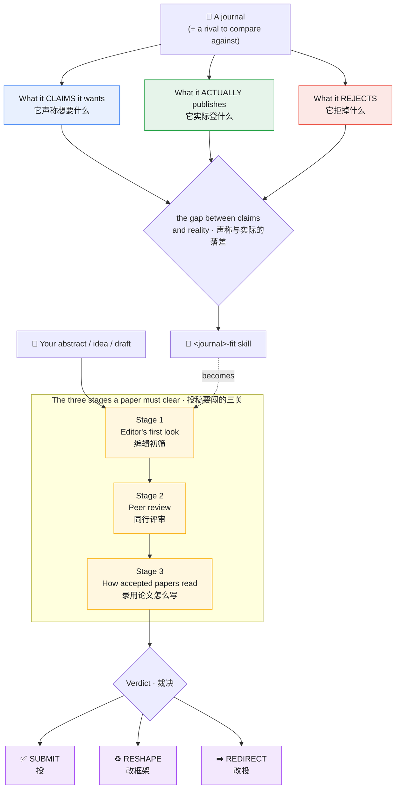

# Journal Decoder · 期刊解码器

> **Distill any academic journal into a reusable Claude skill** — learn its topic taste and house writing style from its own papers, then judge fit and reframe your manuscript to match.
> **把任何学术期刊蒸馏成一个可复用的 Claude 技能**——从它自己的论文里学出它的选题口味和写作风格，再用来判断选题适配、把稿子改写成该刊风格。

A [Claude Code](https://docs.anthropic.com/en/docs/claude-code) / Claude Agent **skill**. Point it at a journal; it reverse-engineers how that journal selects and writes, and ships a standalone `<journal>-fit` child skill you can reuse forever.

一个 Claude Code / Claude Agent **技能**。把它对准一本期刊，它会逆向工程这本刊"怎么选稿、怎么写"，并产出一个可永久复用的 `<journal>-fit` 子技能。



> **Distill** the journal (left) into a reusable skill, then run your manuscript through the **three stages** (right) for a verdict.
> 先把期刊**蒸馏**成可复用技能，再让你的稿子闯它的**三关**，得到裁决。

---

## What it does · 它做什么

Give it a journal name (and ideally one rival journal to compare against). It produces a child skill — e.g. `computers-education-fit` — that can:

给它一个期刊名（最好再给一本对手刊做对照），它会产出一个子技能（如 `computers-education-fit`），能：

- **Judge fit / 判断适配** — run a topic, abstract, or idea through the journal's three stages and return a **`SUBMIT` / `RESHAPE` / `REDIRECT`** verdict with reasons.
- **Reframe your draft / 重构草稿** — stage-by-stage edits to match the journal's scope, contribution type, and writing style (abstract recipe, title patterns, structure).

It is **tool-agnostic**: the distillation runs on plain web access + reading PDFs, so anyone can use it. No paid APIs required.

它**不绑定任何工具**：蒸馏靠普通联网 + 读 PDF 即可，任何人都能用，不需要付费 API。

---

## How it works · 工作原理

Most "journal writing tips" are true of the whole field — useless as guidance. Journal Decoder keeps only what actually sets one journal apart from its neighbors, using two simple ideas:

大多数"期刊写作建议"对整个领域都成立——等于没说。期刊解码器只保留真正能把一本刊和邻刊区分开的东西，靠两个简单想法：

### Idea 1 · Read three things about the journal — and compare them
### 想法一 · 读懂一本期刊的三样东西，并互相对照

| Read… / 读什么 | From… / 来源 | Tells you… / 看出什么 |
|---|---|---|
| **What it claims it wants** / 它声称想要什么 | Aims & Scope, author guidelines | the official pitch (trust least) |
| **What it actually publishes** / 它实际登什么 | recent papers | the real answer (ground truth) |
| **What it rejects** / 它拒掉什么 | reviewer criteria, desk-reject signals | the hidden filter — what quietly kills a paper |

The most useful thing you can find is **the gap between what a journal claims and what it actually publishes**: e.g. it *says* it welcomes theory but publishes <2% theory → a theory-only paper is at high risk of being rejected without review. That gap is the insight a generic guide can't give you.

最有价值的，是**"它声称的"和"它实际登的"之间的落差**：比如它*说*欢迎理论，实际理论稿不到 2% → 纯理论稿很可能连送审都到不了。这个落差正是泛泛的指南给不了你的洞察。

### Idea 2 · A paper has to clear three stages
### 想法二 · 一篇论文要闯三关

A paper isn't accepted in one move — it clears **Stage 1 the editor's first look → Stage 2 peer review → Stage 3 the writing style of accepted papers**. The decoder maps fit to each stage, so you learn *which stage* a paper would fail at, not just *whether*.

论文不是一步被录用，而是要闯过 **第一关 编辑初筛 → 第二关 同行评审 → 第三关 录用论文的写法**。解码器把"合不合适"对应到每一关，让你知道稿子会**在哪一关**挂掉，而不只是"行不行"。

### The one rule: the rival-journal test · 唯一铁律：改投测试
> A finding is kept **only if knowing it would change which of two similar journals you'd submit to.** Anything two neighboring journals want equally is a field-wide norm — dropped.
> 一条发现只有"知道它会改变你在两本相似期刊之间该投哪本"时才保留。两本邻刊都同样想要的，就是全领域通用规范，丢掉。

That's why you give it a **rival journal** — it's how the decoder tells this journal's house style apart from the whole field's norms.

所以你要给它一本**对手刊**——这是解码器区分"这本刊的家风"和"全领域规范"的办法。

---

## Install · 安装

```bash
# user-level (available in every project) / 用户级（所有项目可用）
git clone https://github.com/Youn-17/journal-decoder.git
cp -R journal-decoder ~/.claude/skills/journal-decoder
# (remove README/LICENSE/examples if you want a lean install)

# or project-level / 或项目级
mkdir -p .claude/skills && cp -R journal-decoder .claude/skills/journal-decoder
```

Restart Claude Code so it picks up the new skill. The only required file is `SKILL.md` (+ `references/`).

重启 Claude Code 以加载技能。必需文件只有 `SKILL.md`（加 `references/`）。

---

## Usage · 用法

Just talk to it. It triggers on phrases like:

```
Distill the journal Computers & Education     # 直接蒸馏一本刊
蒸馏 Journal of the Learning Sciences          # rival journal optional
I work on GenAI + learning analytics — which journal should I target?   # 模糊需求，先推荐候选
```

Once a journal is distilled, use the child skill:

```
Is this abstract a fit for Computers & Education?  [paste abstract]
这篇适合投 Computers & Education 吗：[贴摘要]
Reframe this draft for Computers & Education's style
```

---

## Example output · 示例成果

[`examples/computers-education-fit/`](examples/computers-education-fit/) is a real distillation of **Computers & Education** (Elsevier), built from ~310 recent + top-cited papers and official guidance, with BJET as the rival journal. Open its `SKILL.md` to see the format, and `references/evidence/` for the sourced research behind it — what the journal *claims*, what it *publishes*, what it *rejects*, and how it differs from BJET.

[`examples/computers-education-fit/`](examples/computers-education-fit/) 是对 **Computers & Education** 的一次真实蒸馏（基于约 310 篇近作/高被引 + 官方指南，对照刊 BJET）。打开它的 `SKILL.md` 看格式，`references/evidence/` 是背后有据可查的调研：它*声称*什么、*实际登*什么、*拒*什么，以及与 BJET 的区别。

---

## Repo layout · 仓库结构

```
journal-decoder/
├── SKILL.md                       # the decoder itself · 解码器主体
├── references/
│   ├── signal-mining.md           # how to keep the real signal, drop noise · 提炼真信号
│   └── fit-skill-template.md      # skeleton for each <journal>-fit skill · 子技能骨架
└── examples/
    └── computers-education-fit/   # a real distilled journal · 一个真实蒸馏样例
```

---

## Honesty by design · 诚实设计

The decoder is built to refuse to fake it:
- never fabricates acceptance rates, review times, or preferences the evidence doesn't show;
- never dresses up field-wide norms as a journal's special taste;
- always surfaces the claims-vs-reality gap instead of parroting the Aims & Scope;
- states its limits — fit raises the odds, it never guarantees acceptance.

解码器在设计上拒绝"编造"：不伪造录用率/周期、不把通用规范包装成独有口味、永远点出"声称 vs 实际"的落差、明确标注"fit 高只提高概率不保证录用"。

---

## Contributing · 贡献

PRs welcome — especially new distilled journals under `examples/`, and improvements to the methodology. Please keep distillations grounded in real, sourced evidence.

欢迎 PR——尤其是 `examples/` 下新增的已蒸馏期刊，以及对方法论的改进。请保证每次蒸馏都基于真实、可溯源的证据。

---

## Author & License · 作者与许可证

Created by **Adrian** ([@Youn-17](https://github.com/Youn-17)). Licensed under [MIT](LICENSE) © 2026 Adrian.

> Made with [Claude Code](https://claude.com/claude-code).
