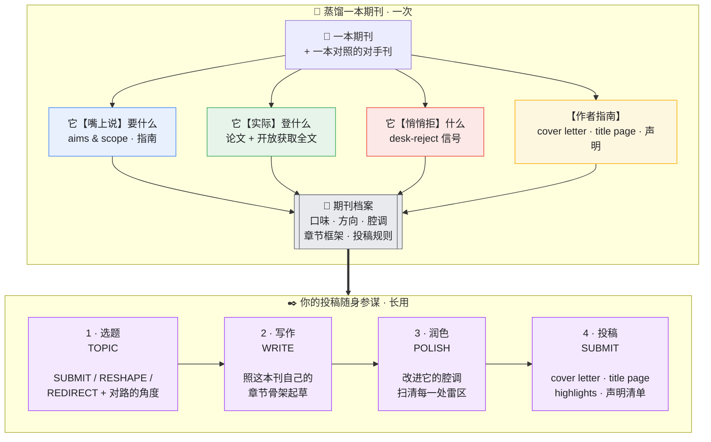

<div align="center">

# Imprimatur · 付梓

### 把一本期刊读到骨子里，再让它为你点头。

**将任何一本学术期刊，蒸馏成一个可复用的 Claude 技能——它懂这本刊的脾性、写得出它的笔法，并陪你把一篇稿子从最初的念头，一路送到投稿那一刻。**

[English](README.md) · [中文](README_zh.md)

<sub>*imprimatur*：拉丁语「准予付梓」，旧时书稿获准刊印的印记。</sub>

</div>

---

每一本期刊都有自己的脾性。它偏爱某一类问题，又不动声色地把另一类挡在门外；同一个贡献，换一种框法它就点头，换一种它就退稿；那些被录用的论文之间，有一种你感觉得到、却说不清的腔调。多数作者只能在一次次退稿里，把这些慢慢"悟"出来——代价是几年光阴。

**付梓（Imprimatur）把这场漫长的师承，压缩进一次调研。** 你把它对准一本期刊，它会去读：这本刊**嘴上说**要什么、**手上**到底登什么、又悄悄**拒**掉什么，以及它完整的作者指南——能找到开放获取全文时，连正文一并读透。然后，它把这一切打包成一个独立技能 `<journal>-fit`，成为你投这本刊的随身参谋：替你判断选题是否对路，按这本刊自己的骨架替你起草，把文字润成它的腔调，最后连 cover letter 和 title page 一起递到你手上。

为 [Claude Code](https://docs.anthropic.com/en/docs/claude-code) 与 Claude Agent SDK 打造。**不依赖任何付费接口、不绑定任何平台**——普通联网加读 PDF 即可运转，人人可用。

---

## 一张图看懂



**蒸馏一次，长久受用。** 一次调研建起期刊档案；之后每次投这本刊，留下的 `<journal>-fit` 技能都帮得上。

---

## 它会读懂一本期刊的什么

| | 维度 | 它捕捉到的 |
|---|---|---|
| 1 | **定位与范围** | 官方的自我介绍——以及它在实际中到底意味着什么 |
| 2 | **选题口味与方向** | 它登什么、什么正当红、什么已写滥、编辑心里想要却收得少的那块缺口 |
| 3 | **作者指南 → 投稿包** | 字数与摘要上限、Highlights，它期待的 **cover letter** 写法、**title page** 的确切要素、每一项强制声明（利益冲突、CRediT、数据、伦理、AI 使用）、参考文献体例 |
| 4 | **笔法与框架** | 从发表论文、以及开放获取全文里学：逐章节的行文"动作"、摘要配方、标题套路、那股腔调 |
| 5 | **编辑决策模型** | 一篇稿子要过的三道关——编辑初筛 → 同行评审 → 录用论文的样子——以及那些让稿子早早出局的红旗 |

---

## 你拿它做什么——四步

> **① 选题 TOPIC｜这篇，该不该投这里？**
> 把一个念头或一段摘要交给它。它让你的稿子在这本刊的"守门人"面前走一遍，给出判断——**SUBMIT**（投）、**RESHAPE**（对刊，错框，得改）、或 **REDIRECT**（另投他处，并告诉你投哪）——再递上两三个真正对这本刊胃口的角度。

> **② 写作 WRITE｜照这本刊的写法，帮我起草。**
> 它把这本刊自己的骨架交给你：引言如何层层收束到那道缺口、研究问题落在第几步、方法怎样分节、结果怎么报告、讨论有哪几个固定动作——再附上摘要配方与标题套路，每一条都钉在一篇真实发表的论文上。

> **③ 润色 POLISH｜让我的草稿，读起来像是这儿的。**
> 贴上一段、或一整篇。它在**你自己的句子**上动笔——干净的"改前 → 改后"——挑出每一处不合腔调的地方，替你卡住字数与摘要上限，扫清每一个会被编辑直接退稿的坑。

> **④ 投稿 SUBMIT｜让我，可以投了。**
> 它按这本刊期待的脉络替你起草 **cover letter**，按它要求的确切要素排好 **title page**（并照顾双盲规则），备齐 Highlights 与结构化摘要，再过一遍**声明清单**——不让任何一处小疏漏，把你拦在编辑的案头之外。

---

## 看它怎么工作——以《Computers & Education》为例

仓库里附了一份完整、句句有出处的蒸馏成果：[`examples/computers-education-fit/`](examples/computers-education-fit/)。尝一口它能做什么：

**选题** —— *"这个适合投吗？我做了个 ChatGPT 插件，在自己班上调查了 40 个学生，85% 说有帮助、好用。"*
> **REDIRECT，勉强可 RESHAPE。** 两面红旗同时亮起：这是一个单班的**满意度/接受度**调查，**没有可测的学习结果**，也走不出一间教室。要够得上 C&E，得把满意度问卷换成能测某个学习构念的设计（比如对照组之下的自我调节提升），并讲清它为何可推广。照现状，技术接受度类的期刊更适合它。

**写作** —— 一个 C&E 式的标题与摘要骨架：
> *标题*（点名构念 + 暗示设计）："The effect of GPT-based scaffolding on self-regulated learning: A quasi-experimental study"。
> *摘要*（≤250 词，六个动作）：在线学习里自我调节为何要紧 → 缺口 → 你做了什么（设计 + 样本量）→ 方法一句话 → 关键效应及其大小 → 对教学意味着什么。

**润色** —— 一句话，改前 → 改后：
> ~~"学生很喜欢这个工具，觉得很好用。"~~ → "使用 GPT 支架的学生，在自我调节学习上的得分高于对照组（*d* = 0.42），表明该支架支持了元认知监控。" *（C&E 看重的是可测的学习效应，不是满意度。）*

**投稿** —— 它替你起好的 cover letter 开头，外加一份双盲 title page 清单、一份声明清单（利益冲突 · CRediT · 数据可用性 · AI 使用）：
> "Dear Editor，我们投稿《The effect of GPT-based scaffolding on self-regulated learning》…在为期 12 周的准实验（N = 210）中，该支架相较匹配对照组提升了自我调节学习的结果——这正回应了广义教育界共同关心的问题：生成式 AI 如何**支持**、而非**取代**学生的自我调节……"

上面每一句，都能在 [`examples/computers-education-fit/references/evidence/`](examples/computers-education-fit/references/evidence/) 里找到出处：C&E *说*什么、*登*什么、*拒*什么，它的*作者指南*、它的*写作框架*（自三篇开放获取全文逆向而来），以及它与 BJET 的分野。

---

## 为什么它既锋利，又诚实

绝大多数"投稿建议"对整个领域都成立（用 IMRaD、记得写局限）——也正因如此，等于没说。付梓只保留一条标准下的发现：**知道它，会改变你在两本相似期刊之间的取舍**——这就是"改投测试"。所以你要给它**一本对手刊**作镜子：唯有对照，才能把"这本刊的家法"从"全领域的常识"里剥出来。

它也绝不虚张声势。它不编造录用率与指南细节，不把全领域的常识包装成某本刊的独门口味，永远点破"嘴上说"与"实际登"之间的落差，并且只许下它唯一守得住的承诺：**契合，只提高胜算，永不保证录用。** 它生成的投稿包是一份待核对的草稿——投稿前，请仍以期刊最新的作者指南为准。

---

## 安装

```bash
git clone https://github.com/Youn-17/imprimatur.git

# 用户级（所有项目可用）
cp -R imprimatur ~/.claude/skills/imprimatur

# 或项目级
mkdir -p .claude/skills && cp -R imprimatur .claude/skills/imprimatur
```
重启 Claude Code。必需文件只有 `SKILL.md` + `references/`。想直接用已蒸馏好的期刊，把 `examples/computers-education-fit` 也复制进 skills 目录即可。

## 用法

```
蒸馏 Computers & Education                      —— 构建投稿参谋
我做 GenAI + 学习分析，该投哪本刊？              —— 它先给你几个候选

# 蒸馏完成后：
这段摘要适合投 Computers & Education 吗：[贴摘要]
帮我按 C&E 风格写一段引言
帮我写投 C&E 的 cover letter 和 title page
```

## 仓库结构

```
imprimatur/
├── SKILL.md                       # 蒸馏器（5 块档案 + 7 步构建）
├── references/
│   ├── signal-mining.md           # 提炼真信号；全文 → 框架；指南 → 投稿包
│   └── fit-skill-template.md      # 每个 <journal>-fit 参谋的骨架
└── examples/
    └── computers-education-fit/   # 一本真实、完整蒸馏的期刊
        ├── SKILL.md
        └── references/evidence/   # claims · published · rejected · guidelines · writing-framework · rival-bjet
```

## 贡献

诚挚欢迎 PR——尤其是 `examples/` 下新增的已蒸馏期刊，以及对方法的打磨。只有一条规矩：每一次蒸馏，都要落在真实、可溯源的证据上（每条都带 URL 与可信度标签）。

## 作者与许可证

由 **Adrian**（[@Youn-17](https://github.com/Youn-17)）创作 · 基于 [MIT](LICENSE) © 2026 Adrian 开源。

> Made with [Claude Code](https://claude.com/claude-code).
