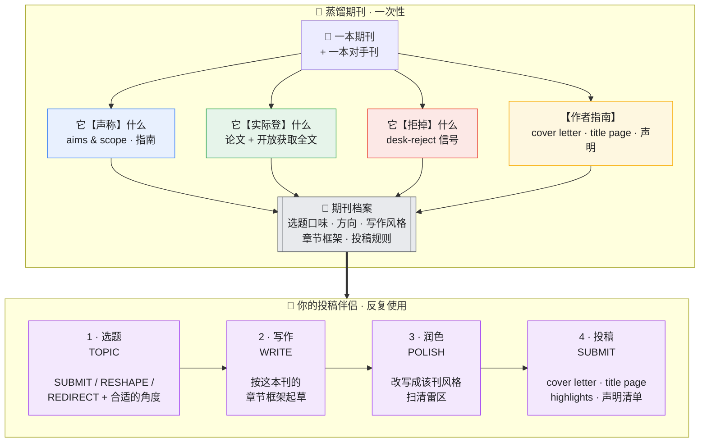

<div align="center">

# 📕 Journal Decoder · 期刊解码器

**把任何学术期刊蒸馏成一个可复用的 Claude 技能——再让它带你从选题一路走到投稿。**

[English](README.md) · [中文](README_zh.md)

</div>

> 把期刊解码器对准一本期刊，它会研究这本刊**发表过的论文、作者指南、aims & scope**（能找到开放获取全文时连全文一起读），打包成一个独立技能 `<journal>-fit`，成为你的**投稿伴侣**：判断你的选题适不适合、按这本刊的框架帮你起草论文、把它润色成该刊风格，并写好你的 **cover letter** 和 **title page**。

一个用于 [Claude Code](https://docs.anthropic.com/en/docs/claude-code) 和 Claude Agent SDK 的技能。**不绑定任何工具**——靠普通联网 + 读 PDF 即可，不需要付费 API。

---

## 工作原理 · 全景图



**蒸馏一次，反复使用。** 蒸馏一本刊只需一次调研；得到的 `<journal>-fit` 技能之后每次投这本刊都能用。

---

## 它会学一本期刊的什么 · 期刊档案（5 块）

| # | 模块 | 它捕捉什么 |
|---|------|-----------|
| 1 | **Aims & Scope 定位** | 官方定位——以及它在实际中到底意味着什么 |
| 2 | **选题口味与方向** | 它登什么、什么在升温、什么已饱和、它想要却收得少的缺口 |
| 3 | **作者指南 → 投稿包** | 字数/摘要上限、Highlights、**cover letter** 要点、**title page** 要素、强制声明（利益冲突、CRediT、数据、伦理、AI 使用）、参考文献体例 |
| 4 | **写作风格与框架** | 从发表论文*和开放获取全文*里学：逐章节的"动作结构"、摘要配方、标题套路、语气 |
| 5 | **编辑决策模型** | 论文要闯的三关（编辑初筛 → 同行评审 → 录用论文的写法）+ desk-reject 雷区 |

---

## 四步投稿伴侣 · 你实际拿它做什么

### 1 · 选题 TOPIC — *"这篇该投这里吗？"*
给它一个 idea 或摘要。它让你的稿子走一遍这本刊的三关，给出裁决——**SUBMIT**（投）、**RESHAPE**（对刊错框，要改）、或 **REDIRECT**（改投别处，并告诉你投哪）——再给 2–3 个**符合这本刊口味**的选题角度。

### 2 · 写作 WRITE — *"照这本刊的写法帮我起草。"*
它把这本刊自己的逐章节骨架交给你：引言怎么层层收窄到缺口、研究问题落在哪、方法怎么分小节、结果怎么报告、讨论的六个动作——外加摘要配方和标题套路，每条都锚定一篇**真实发表论文**的范例。

### 3 · 润色 POLISH — *"让我的草稿读起来像是这本刊的。"*
贴一段或整篇草稿。它在**你自己的文字**上做 **before → after**，逐句标出不符合该刊风格的地方，卡住字数/摘要上限，并扫清每一个 desk-reject 雷区。

### 4 · 投稿 SUBMIT — *"帮我备齐投稿材料。"*
它生成你的 **cover letter**（按这本刊期待的要点）、**title page**（精确到所需要素，并遵守盲审规则）、Highlights / 结构化摘要，以及一份**声明清单**，确保没有任何一项触发 desk reject。

---

## 一个完整例子（Computers & Education）

仓库自带一个真实蒸馏成果：[`examples/computers-education-fit/`](examples/computers-education-fit/)。下面是它能驱动的交互。

**① 选题 TOPIC**
> **你：** 这个适合投 C&E 吗？*"我做了个 ChatGPT 插件，在自己班上调查了 40 个学生，85% 说有帮助、好用。"*
>
> **伴侣：** **REDIRECT / 勉强可 RESHAPE。** 命中两个第一关雷区：这是**单班的满意度/接受度调查**（TAM 式的"有帮助、好用"），**没有可测的学习结果**，也没有超越单个课堂的意义。要为 C&E 改造：把满意度问卷换成能测某个学习构念的设计（如对照组比较自我调节学习的提升），并论证它为何可推广。照现状，它更适合技术接受度类或面向一线教师的期刊，而不是 C&E。

**② 写作 WRITE** — *"给我一个 C&E 风格的标题和摘要骨架。"*
> **标题套路：** *点名构念 + 暗示设计* → 例："The effect of GPT-based scaffolding on self-regulated learning: A quasi-experimental study"。
> **摘要（≤250 词，6 个动作）：** ① 在线学习中自我调节为何重要 → ② 缺口 → ③ 你做了什么（设计 + 样本量）→ ④ 方法一句话 → ⑤ 关键结果带效应量 → ⑥ 对教与学的启示。

**③ 润色 POLISH** — 一句话的 before → after：
> **改前：** "学生很喜欢这个工具，觉得很好用。"
> **改后：** "使用 GPT 支架的学生在自我调节学习得分上高于对照组（d = 0.42），表明该支架支持了元认知监控。" *（C&E 看重可测的学习效应，不是满意度。）*

**④ 投稿 SUBMIT** — 它帮你起草的 cover letter 开头：
> "Dear Editor, 我们投稿《The effect of GPT-based scaffolding on self-regulated learning》……在为期 12 周的准实验（N = 210）中，该支架相较匹配对照组提升了自我调节学习结果——这正回应了广义教育界关心的问题：生成式 AI 如何**支持**而非**取代**学生的自我调节……"
> ……外加一份 **title page 清单**（C&E 是双盲 → 身份信息放独立题名页）和一份**声明清单**（利益冲突、CRediT、数据可用性、AI 使用）。

打开 [`examples/computers-education-fit/references/evidence/`](examples/computers-education-fit/references/evidence/) 可以看到上面每一句背后**有出处的调研**：C&E *声称*什么、*实际登*什么、*拒*什么、它的*作者指南*、它的*写作框架*（来自 3 篇开放获取全文），以及它与 BJET 的区别。

---

## 让它保持锋利的唯一铁律 · 改投测试

大多数"期刊写作建议"对整个领域都成立（用 IMRaD、写局限）——等于没说。期刊解码器只保留**"知道它会改变你在两本相似期刊之间该投哪本"**的发现。所以你要给它**一本对手刊**来对照——这是它区分"*这本刊的*家风"和"全领域规范"的办法。没有对手刊，结果就会沦为泛泛建议。

它在设计上也**诚实**：绝不编造录用率或指南细节、不把全领域规范包装成独有口味、永远点出"声称"与"实际"的落差，并提醒你——fit 高只提高概率，永不保证录用。

---

## 安装

```bash
git clone https://github.com/Youn-17/journal-decoder.git

# 用户级（所有项目可用）
cp -R journal-decoder ~/.claude/skills/journal-decoder

# 或项目级
mkdir -p .claude/skills && cp -R journal-decoder .claude/skills/journal-decoder
```
重启 Claude Code。必需文件只有 `SKILL.md` + `references/`。想直接用已蒸馏好的期刊，把 `examples/computers-education-fit` 也复制进 skills 目录即可。

## 用法

```
蒸馏 Computers & Education                # 构建投稿伴侣
蒸馏 Journal of the Learning Sciences      # 对手刊可选
我做 GenAI + 学习分析，投哪本刊好？         # 模糊需求 → 它先推荐候选

# 蒸馏完成后：
这篇摘要适合投 Computers & Education 吗：[贴摘要]
帮我按 C&E 风格写引言
帮我写投 C&E 的 cover letter 和 title page
```

---

## 仓库结构

```
journal-decoder/
├── SKILL.md                       # 解码器（5 块蒸馏 + 7 步构建）
├── references/
│   ├── signal-mining.md           # 提炼真信号；全文→框架；指南→投稿包
│   └── fit-skill-template.md      # 每个 <journal>-fit 伴侣的骨架
└── examples/
    └── computers-education-fit/   # 一个真实、完整蒸馏的期刊
        ├── SKILL.md
        └── references/evidence/   # claims · published · rejected · guidelines · writing-framework · rival-bjet
```

## 贡献

欢迎 PR——尤其是 `examples/` 下新增的已蒸馏期刊，以及对方法论的改进。请保证每次蒸馏都基于真实、可溯源的证据（每条都带 URL + 可信度标签）。

## 作者与许可证

由 **Adrian**（[@Youn-17](https://github.com/Youn-17)）创建。基于 [MIT](LICENSE) © 2026 Adrian 开源。

> Made with [Claude Code](https://claude.com/claude-code).
